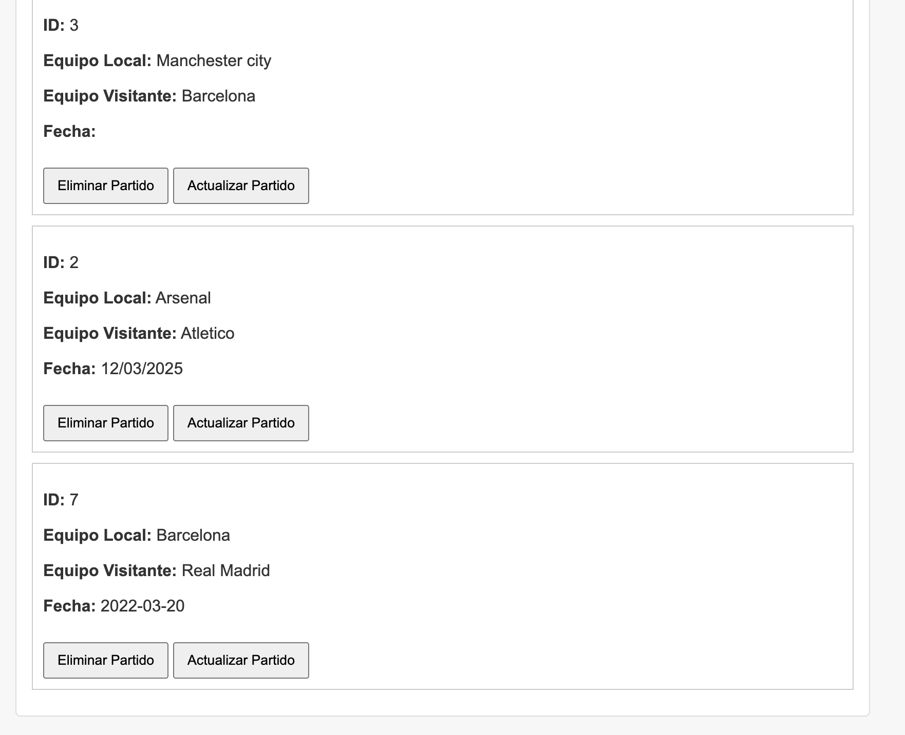
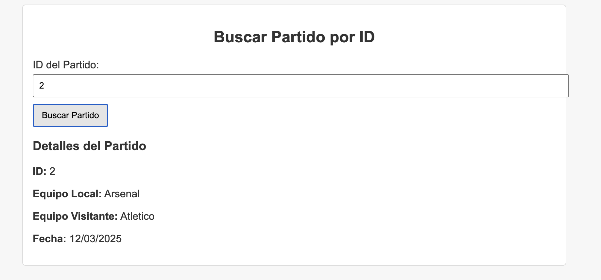
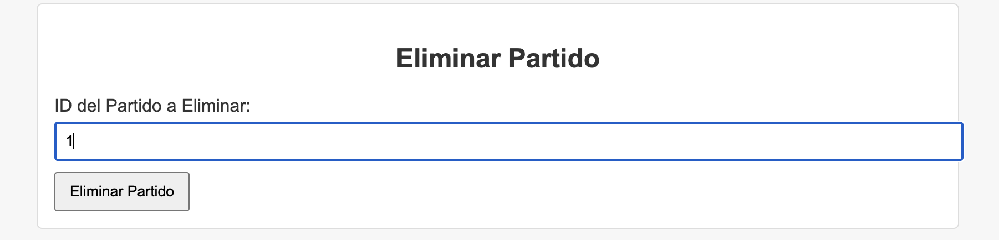
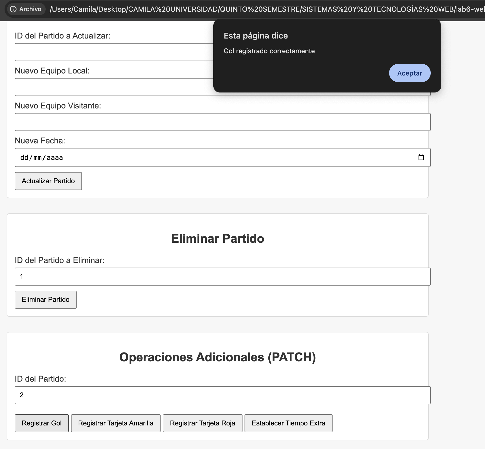

# lab6-web
# **Football Match API**

API para gestionar partidos de fútbol, incluyendo la creación, actualización, eliminación, y registro de eventos como goles, tarjetas amarillas, tarjetas rojas y tiempo extra.

## **Tabla de contenidos**

- [Descripción](#descripción)
- [Tecnologías](#tecnologías)
- [Instalación](#instalación)
- [Documentación de Swagger](#documentación-de-swagger)
- [Imágenes](#imágenes)
- [Clonación del Repositorio](#clonación-del-repositorio)

## **Descripción**

Esta API permite gestionar partidos de fútbol, registrar goles, tarjetas amarillas, tarjetas rojas y el tiempo extra de los partidos. Los partidos pueden ser creados, leídos, actualizados y eliminados. También se pueden registrar eventos durante el partido, como goles o tarjetas, y modificarse atributos como el tiempo extra.

## **Tecnologías**

- Go (Golang)
- PostgreSQL (para la base de datos)
- Swagger (para documentación)
- Mux (router para Go)

## **Instalación**

Instalar Go en la computadora
- instala las dependencias con go mod tidy
Instalar Swagger para la documentación
Instalar y configurar PostgreSQL
- Asegúrate de tener una base de datos PostgreSQL configurada correctamente y ejecutándose. Luego, actualiza el archivo de configuración de la base de datos (database.go) con tus credenciales de conexión.

### **Imágenes**







### **Clonación del Repositorio**

```bash
git clone https://github.com/CamiR24/lab6-web.git
cd tu-repositorio
